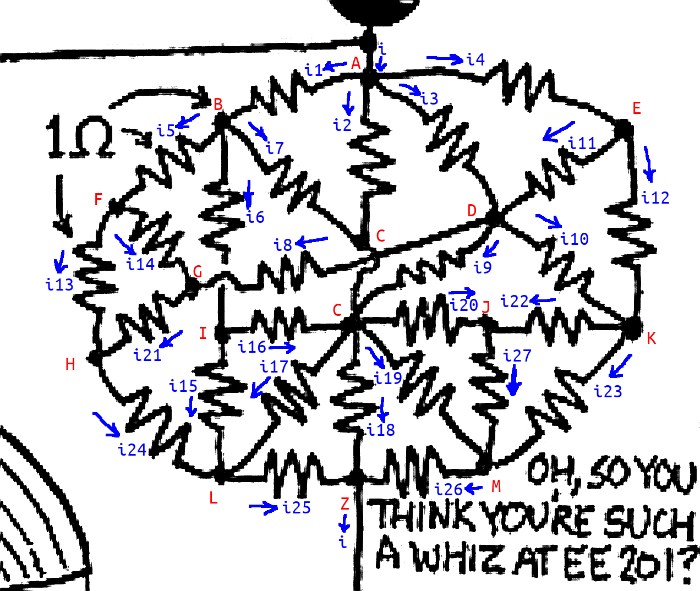

# Calculating the Resistor Mass featured in XKCD #730 #

Would I call it [nerd-sniping](https://xkcd.com/356/) that I couldn't resist solving this?  I have to say maybe, because to be honest, it wasn't that bad so maybe I had time to dodge the truck.

## The Problem

### Given
As you can see in the [original post](https://xkcd.com/730/), there is a resistor mass off to the center-right of the image with a nice challenge "Oh, so you think you're such a whiz at EE 201?"  As an additional incentive, the alt-text of the image states, "I just caught myself idly trying to work out what that resistor mass would actually be, and realized I had self-nerd-sniped."

### Find
Needless to say, I had to reduce that resistor mass to a single equivalent value.  Of course, I wanted to see if someone had beaten me to the punch and they problem have, but perhaps they haven't posted it or I wasn't able to find their post.  Therefore, I decided to solve it myself and post my approach to the problem.  BTW, I was able to find [PSPICE simulations](https://www.reddit.com/r/xkcd/comments/7wchnq/value_of_resistor_network_in_730/), but being a "whiz at EE 201" doesn't mean just plugging stuff into PSPICE.

## The Solution

### Reduce
The very first thing is to look for "freebies" in the diagram, such as resistors in series or parallel, but alas, there were none that I could spot!  [Randall](https://xkcd.com/about/) knows what he's doing.

### Label
The next thing to do is to start labeling - labeling nodes (red) and currents (blue) are all that's required.

### Extract Equations

Two formulas can be used to start writing down equations:  [Ohm's Law](https://en.wikipedia.org/wiki/Ohm%27s_law) and [Kirchhoff's Current Law](https://en.wikipedia.org/wiki/Kirchhoff%27s_circuit_laws#Kirchhoff's_current_law).

Ohm's Law states that the voltage across a resistor (V) = current through the resistor (I) multiplied by the resistance (R).  **V=IR**
Kirchhoff's Current Law states that the sum of current going into a node equals zero.  This is why there are arrows drawn for current - because directionality matters in these equations.

So given these two laws of electrical engineering, we can come up with a plethora of equations.

For each node (except nodes A and Z), there is Kirchhoff's Law:
<pre>
A:  i = i1 + i2 + i3 + i4 = i18 + i25 + i26
B:  i1 = i5 + i6 + i7
C:  i2 + i7 + i9 + i16 = i17 + i18 + i19 + i20
D:  i3 + i11 = i8 + i9 + i10
E:  i4 = i11 + i12
F:  i5 = i13 + i14
G:  i8 + i14 = i21
H:  i13 + i21 = i24
I:  i6 = i15 + i16
J:  i20 + i22 = i27
K:  i10 + i12 = i22 + i23
L:  i15 + i17 + i24 = i25
M:  i19 + i23 + i27 = i26
Z:  i = i18 + i25 + i26
</pre>
Really, we need to combine the equations at nodes A and Z, because we only want to focus on what's between nodes A and Z:
<pre>
A/Z:  i1 + i2 + i3 + i4 = i18 + i25 + i26
</pre>

Let's use Ohm's Law for each loop within the circuit.  For example, the nodes A-B-C create a loop, as do B-F-H-L-I.  Let's look at A-B-C as an example.  In order to use Ohm's Law in this way, we just need to pick two different nodes.  Let's pick A and C.  Let C be 0V.  To get the voltage at A, we can say:
<pre>
Va = Vc + i2 * R
Va = Vc + i7 * R + i1 * R
Vc + i2 * R = Vc + i7 * R + i1 * R    Combining the two equations
i2 * R = (i7 + i1) * R                Subtract Vc from both sides
i2 = i7 + i1                          Divide both sides by R
</pre>
That gives us yet another equation using only our number-labeled resistors.

Doing that for all loops:
<pre>
A-B-C:      i2 = i1 + i7
A-B-F-G-D:  i1 + i5 + i14 = i3 + i8
A-C-D:      i2 = i3 + i9
A-D-E:      i3 = i4 + i11
B-C-I:      i7 = i6 + i16
B-F-H-L-I:  i5 + i13 + i24 = i6 + i15
C-D-K-J:    i10 + i22 = i9 + i20
C-D-G-H-L:  i8 + i21 + i24 = i9 + i17
C-I-L:      i16 + i17 = i15
C-J-M:      i19 = i20 + i27
C-M-Z:      i19 + i26 = i18
D-E-K:      i10 + i11 = i12
F-G-H:      i14 + i21 = i13
J-K-M:      i22 + i27 = i23
</pre>

Also using Ohm's Law, we can create a connection between nodes A and Z in order to introduce a "true" value into our set of equations since the rest of it is simply symbolic so far:
<pre>
Vc = Vz + i18 * R
Va = Vc + i2 * R

Remember, let Va = 1, Vc = 0.  This is us "probing" the circuit.
  Vc = i18 * R
  1(volt) = Vc + i2 * R
Substitute the former into the latter.
  1(volt) = i18 * R + i2 * R
Divide by R.
  1(amp) = i2 + i18
</pre>

We now have 28 equations and 27 unknowns (*i1*...*i27*).  If the equations are independent, that should be (more than) enough to solve for all the currents.  To do so, we simply place all the equations into a matrix A of coefficients that are multiplied by the variables [i1..i26] and a constant [1] in order to equal a 0 vector.

<pre>
Ax = 0
A = coefficients from the equations
x = [i1, i2, i3, ... i24, i25, i26, 1]T

So the row for the B-F-H-L-I loop can be found as follows, starting with the equation from above:
  i5 + i13 + i24 = i6 + i15
Move all to one side (sorry for the unnatural side-picking):
  -i5 + i6 - i13 + i15 - i24 = 0
Which is the same as:
  0 * i1 + 0 * i2 + 0 * i3 + 0 * i4 + (-1) * i5 + (1) * i6 + ...
Which corresponds to:
[ 0, 0, 0, 0,-1, 1, 0, 0, 0, 0, 0, 0,-1, 0, 1, 0, 0, 0, 0, 0, 0, 0, 0,-1, 0, 0, 0, 0],
</pre>

To solve for each current, you simply have to perform [Gaussian Elimination](https://en.wikipedia.org/wiki/Gaussian_elimination) to put the matrix in [Reduced Row Echelon Form](https://en.wikipedia.org/wiki/Row_echelon_form#Reduced_row_echelon_form).  Despite this being not too difficult, it can be tedious with a matrix this size and is a procedure that's prone to errors.  Luckily, there are computers that do such things for us.  I chose to use [sympy](https://docs.sympy.org/latest/index.html)'s [Matrix](https://docs.sympy.org/latest/tutorial/matrices.html) class.

You can see the Python script I used [here](./resistor_mass.py).

Running with just these equations did not solve the network entirely; there must have been some linear dependency between a couple equations.  So, I added another equation using Ohm's Law (there were no more Kirchhoff's Current Law equations to add).  I added the following, because i26 was unsolved in the reduction:
<pre>
C-L-Z-M:  i17 + i25 = i19 + i26
</pre>

That did the trick.  Adding that equation into the matrix representation and rerunning the script gives us all the currents:
<pre>
Currents (from Reduced Row Echelon Form)
i0 = 0.332858
i1 = 0.472327
i2 = 0.298239
i3 = 0.233723
i4 = 0.058012
i5 = 0.135378
i6 = 0.139468
i7 = 0.083977
i8 = 0.174088
i9 = 0.104690
i10 = 0.064516
i11 = 0.169206
i12 = 0.066667
i13 = -0.008655
i14 = 0.131288
i15 = 0.004090
i16 = 0.127198
i17 = 0.527673
i18 = 0.118675
i19 = 0.016426
i20 = 0.075322
i21 = 0.085824
i22 = 0.188073
i23 = 0.141988
i24 = 0.400475
i25 = 0.408998
i26 = 0.102249
i27 = 0.000000
</pre>

Going back to our first Kirchhoff's Law equation:
  i = i1 + i2 + i3 + i4 = 1.337146
And using Ohm's Law again:
  R = 1/I = 0.747861
</pre>

...which are precisely the current and resistance found by the PSPICE simulation mentioned above.
