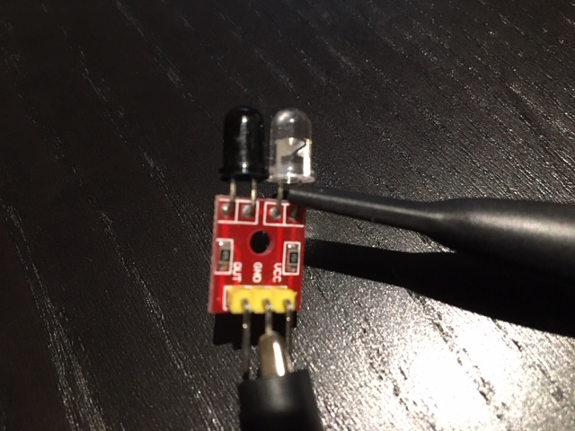
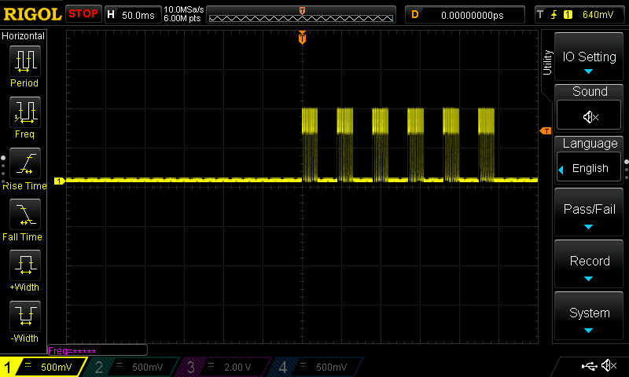
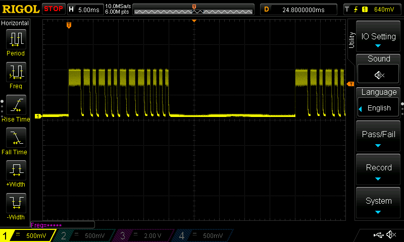
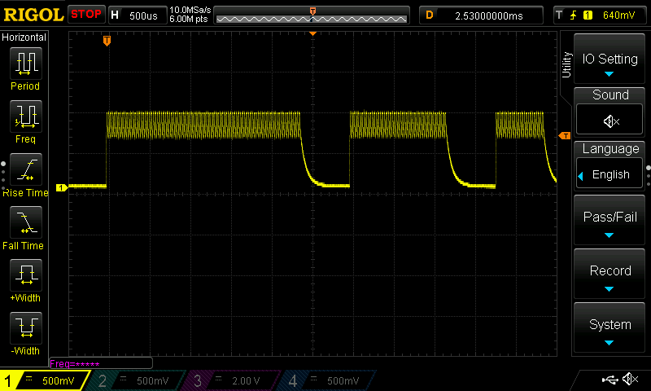

## Using the Raspberry Pi as a IR Remote Control

So the basic plan is send out IR signals from a Raspberry Pi to control a device that I normally control with a common handheld remote control.  At my disposal, I had a RaspPi 3, a Rasp Pi Wireless, and a Rasp Pi 4 all just lying around begging to be used.  If it weren't the case that I had a Raspberry Pi, I'd probably have gone with the [ESP8266](https://www.sparkfun.com/products/13678), but that's a project for another time, because frankly, I like the hyper-convenience of using a Raspberry Pi.

This method is for people who don't have a [USB IR Toy v2](http://dangerousprototypes.com/docs/USB_IR_Toy_v2) to use with [LIRC](https://www.lirc.org/) because they would rather just use the extra IR LED that's laying around (or can be picked up for about 3/$1 or cheaper in bulk).  It's also for people who don't want to scratch their heads at the unclear instructions that accompany some IR libraries and online listings when it comes to reading and generating signal file notation.  This is a very straight-forward approach, but there is a catch - you need an oscilloscope.  I'm using a RIGOL DS1054Z for this report, but originally I used some other one that I borrowed from a friend.  Actually, you don't absolutely *need* an oscilloscope if you can decipher what the signal is supposed to look like based on other sources, but you'll be working blind.

### Quick Note on IR Remote Controls
The signal is by standard simply a 38kHz waveform that is toggled on and off in a specific pattern that may or may not be required to repeat at certain intervals.  This is referred to as [On-Off Keying (OOK)](https://en.wikipedia.org/wiki/On%E2%80%93off_keying) and is really as simple as it sounds.  See the oscilloscope shots below for a slight variant to this definition.  The method used to send IR signals from the Raspberry Pi use this exact definition.

The IR LED I had just laying around was actually a combo IR TX/RX module that came with a [parts kit](https://jetpackacademy.com/shop/digital-electronics-kit/) that's meant to accompany Ian Juby's [Digital Electronics for Robotics](https://jetpackacademy.com/shop/digital-electronics-kit/) course on [Udemy](http://www.udemy.com) (I can't recommend Ian and his courses highly enough).

The circuit board has two LED's next to each other.  The clear one I think is meant to be the transmitter and comes with a resistor in series (to help current limit so you don't fry your LED).  The tinted one is meant to be the receiver and comes with a capacitor in parallel to help flatten out the 38kHz in a [low-pass filter](https://en.wikipedia.org/wiki/Low-pass_filter) fashion.  The way I'm hooking up to it with the oscilloscope, I'm basically just grabbing on to the clear IR LED to measure the voltage that will be generated when I point my remote control at it and push the button (because LED's work both ways).  In the image below, you can see the gator clip chomping down on the GND terminal and my probe hooked on to the other side of the LED.  That means I'm avoiding that series resistor entirely.  This is safe because I'm passively reading the voltage that the LED itself is generating.  When supplying voltage at the terminals, you definitely want a series resistor in there to limit your current!

OK, so now we have a way to receive IR signals and visualize them on the oscilloscope.  There are easy searchable databases out there for remote controller codes and there are devices such as the USB IR Toy that can help you grab some IR signals, but I preferred a more straightforward and fool-proof way:  looking at the transmitted waveform on an oscilloscope.  To do this, I simply hooked up an IR LED directly to my oscilloscope, set the vertical to 500mV/div and set the horizontal to 5ms/div.  I set up a trigger at about 0.7 volts and asked for a SINGLE trigger event.  Then I pointed my Sony TV remote directly at the clear IR LED, hit the "OK" button (well, it's the round button in the center of some arrows) and got this:

You can see the same sequence repeated six times.  What's interesting is that the number of repeats changes every time you hit the button!  I think it goes from three to six and might depend on the state of the battery or how much time passed since the last button push.  I don't think there's a changing rule and you can just use five or six sequences every time to mimic it.  Ahh, but what exactly do we mimic?  Let's look closer for a clearer shot of the code:

So the question is what is all that noise at the top of these otherwise nice, blocky readable 1's and 0's of varying lengths?  That's the 38kHz carrier.  You can see it more clearly in this shot:

And EVEN CLOSER!

The frequency measurement isn't working on this shot, probably because the signal doesn't start until halfway through the window, but you can measure it manually.  Just count the number of cycles per division.  In this case it looks like about 4 cycles in 100 microseconds - that's 25 microseconds/cycle or, inverting that, about 40kHz - right in line with the expected 38kHz.

I had run into issues with infrared remote control routines available on the internet for the raspberry pi.  The main issue:  getting interrupted by the Linux kernel all the time!  Check out the [details](./RaspberryPi_InfraredRemoteControl) for how I did it.
