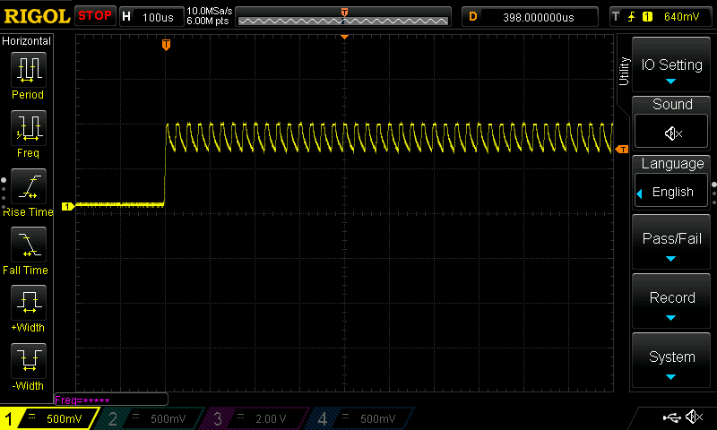
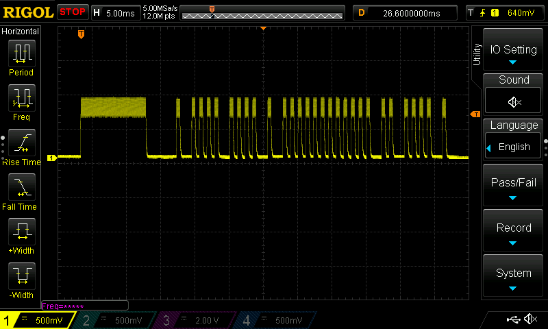

## Using the Raspberry Pi as a IR Remote Control

### The Real Goal

To cut to the chase, I wanted to be able to control my LG in-wall, air-conditioning/heating unit via the Internet (read "my phone") so that I could cool the apartment down (or heat it up) before returning home.  This describes how I did that, with a little Sony TV remote control signal diversion.  Why the diversion?  Because I thought a Sony TV remote signal would be a common one that someone researching this project could use as in a cross-referencing manner.

## Intro

So the basic plan is send out IR signals from a Raspberry Pi to control a device that I normally control with a common handheld remote control.  At my disposal, I had a RaspPi 3, a Rasp Pi Wireless, and a Rasp Pi 4 all just lying around begging to be used.  If it weren't the case that I had a Raspberry Pi, I'd probably have gone with the [ESP8266](https://www.sparkfun.com/products/13678), but that's a project for another time, because frankly, I like the hyper-convenience of using a Raspberry Pi.

This method is for people who don't have a [USB IR Toy v2](http://dangerousprototypes.com/docs/USB_IR_Toy_v2) to use with [LIRC](https://www.lirc.org/) because they would rather just use the extra IR LED that's laying around (or can be picked up for about 3/$1 or cheaper in bulk).  It's also for people who don't want to scratch their heads at the unclear instructions that accompany some IR libraries and online listings when it comes to reading and generating signal file notation.  This is a very straight-forward approach, but there is a catch - you need an oscilloscope.  I'm using a RIGOL DS1054Z for this report, but originally I used some other one that I borrowed from a friend.  Actually, you don't absolutely *need* an oscilloscope if you can decipher what the signal is supposed to look like based on other sources, but you'll be working blind.

### Quick Note on IR Remote Controls
The signal is by standard simply a 38kHz waveform that is toggled on and off in a specific pattern that may or may not be required to repeat at certain intervals.  This is referred to as [On-Off Keying (OOK)](https://en.wikipedia.org/wiki/On%E2%80%93off_keying) and is really as simple as it sounds.  See the oscilloscope shots below for a slight variant to this definition.  The method used to send IR signals from the Raspberry Pi use this exact definition.

## Receiving the Remote Control Signal

The IR LED I had just laying around was actually a combo IR TX/RX module that came with a [parts kit](https://jetpackacademy.com/shop/digital-electronics-kit/) that's meant to accompany Ian Juby's [Digital Electronics for Robotics](https://jetpackacademy.com/shop/digital-electronics-kit/) course on [Udemy](http://www.udemy.com) (I can't recommend Ian and his courses highly enough).

The circuit board has two LED's next to each other.  The clear one I think is meant to be the transmitter and comes with a resistor in series (to help current limit so you don't fry your LED).  The tinted one is meant to be the receiver and comes with a capacitor in parallel to help flatten out the 38kHz in a [low-pass filter](https://en.wikipedia.org/wiki/Low-pass_filter) fashion.  The way I'm hooking up to it with the oscilloscope, I'm basically just grabbing on to the clear IR LED to measure the voltage that will be generated when I point my remote control at it and push the button (because LED's work both ways).  In the image below, you can see the gator clip chomping down on the GND terminal and my probe hooked on to the other side of the LED.  That means I'm avoiding that series resistor entirely.  This is safe because I'm passively reading the voltage that the LED itself is generating.  When supplying voltage at the terminals, you definitely want a series resistor in there to limit your current!

OK, so now we have a way to receive IR signals and visualize them on the oscilloscope.  There are easy searchable databases out there for remote controller codes and there are devices such as the USB IR Toy that can help you grab some IR signals, but I preferred a more straightforward and fool-proof way:  looking at the transmitted waveform on an oscilloscope.  To do this, I simply hooked up an IR LED directly to my oscilloscope, set the vertical to 500mV/div and set the horizontal to 5ms/div.  I set up a trigger at about 0.7 volts and asked for a SINGLE trigger event.  Then I pointed my Sony TV remote directly at the clear IR LED, hit the "OK" button (well, it's the round button in the center of some arrows) and got this:

You can see the same sequence repeated six times.  What's interesting is that the number of repeats changes every time you hit the button!  I think it goes from three to six and might depend on the state of the battery or how much time passed since the last button push.  I don't think there's a changing rule and you can just use five or six sequences every time to mimic it.  Ahh, but what exactly do we mimic?  Let's look closer for a clearer shot of the code:

So the question is what is all that noise at the top of these otherwise nice, blocky readable 1's and 0's of varying lengths?  That's the 38kHz carrier.  You can see it more clearly in this shot:

And EVEN CLOSER!

The frequency measurement isn't working on this shot, probably because the signal doesn't start until halfway through the window, but you can measure it manually.  Just count the number of cycles per division.  In this case it looks like about 4 cycles in 100 microseconds - that's 25 microseconds/cycle or, inverting that, about 40kHz - right in line with the expected 38kHz.

Well, okay, we knew that we needed 38kHz, but what's really interesting is the code itself.  That's what we need to mimic.  In actuality, I wanted to control my LG ductless air conditioning system so here's an example of the OFF command:

Yes, it's sending at 38kHz too.  To get the code, we measure the time distances between on's and off's and recreate it.  To be a little bit more clever, we can measure our basic symbol size so that our code for generating the waveform is more reusable.

## The Codes

Without being given the real format for this signal, it was up to me to just make one up that suited my needs.  I noticed that there was a common header to all signals, which was a long ON of 9300 microseconds followed by a shorter OFF of 4300 microseconds.  The rest of the signals were made up of multiple pulse trains.  For the length of the pulse train, the ON/OFF spacing was constant (450 microseconds on, 750 microseconds off), but there was a doubly-long pause inbetween pulse trains (1500 microseconds).  Here are the codes I was able to record for the LG unit, where the number represents the number of pulses in a sequence of pulse trains.

|Signal|Pattern|
|------|-------|
|OFF|[Header],1,4,4,1,12,2,4,1|
|ON A/C at 74'F|[Header],1,4,12,5,3,1,3|
|ON Heat at 76'F|[Header],1,4,9,3,3,3,3,2,1,1,1,1|

Try to follow the LG OFF signal code using the oscilloscope screengrab above.  It should be obvious - just count the pulses in each group.

## Sending the Remote Control Signal

### Basic Method

So the basic method is to turn a pin on and off at 38kHz for the duration of a high-voltage/1/ON signal and turn it completely off for a low-voltage/0/OFF pulse.  For example, the long pulse at the beginning of the LEG "turn unit OFF" command in the screengrab above lasts about 4300 microseconds.  A 38kHz signal has a period of about 26.31578 microseconds.  We'll be generating a [square wave](https://en.wikipedia.org/wiki/Square_wave), whose fundamental waveform is the sine wave at the same frequency but also contains all the odd harmonics, so it's what we want (the sine wave) and more (all the odd harmonics as decreasing magnitudes), which can be filtered out or simply ignored.  Because a cycle in a square wave is 1 for half of the duration and 0 for the other half of the duration, we need to divide our frequency in half to get our pin control rate, which means we have to be able to control the state of a pin reliably about every 13 microseconds for the total duration of our longest signal, which is over 60 ms!  That's a long time to have uninterrupted program execution in a Linux environment.

To activate the infrared LED, it's simply necessary to connect a resistor in series with it and connect that to controllable voltage source, such as a GPIO pin.  Which resistor should you use?  Well, it depends on your signal voltage and your LED voltage.  The Raspberry Pi GPIO outputs are 3.3V.  I'm using a [NTE30047](https://www.nteinc.com/specs/30000to30099/pdf/nte30047.pdf) that has a forward voltage (VF) of 1.3 V and a Typical Usage Power of 50mW.  So to find resistance, I take 3.3V - 1.3V = 2.0 V (since forward voltage drop over diode's is constant).  This voltage then flows through a resistor, which is going to determine the current in the circuit (see [Kirchhoff's current law](https://en.wikipedia.org/wiki/Kirchhoff%27s_circuit_laws) for why the current through the diode equals the current through the resistor).  If we divide the desired 50mW by 2.0V we get 25mA (power = voltage * current).  Now that I know the desired current and the voltage across the resistor, I can figure out what resistor to use using V=IR (voltage = current * resistance).  In the end, I lowered my current to 10mA to avoid frying it and chose a 200 Ohm resistor.

### Timing is Everything

So the theory is all there and our circuit is there, but now comes the job of making that PIN state change exactly as we need it to.  One of the problems the USB IR Toy v2 mentioned above solves is controlling the pinout at a specified rate.  It can do this because it has a buffer where it stores data and runs its own microcontroller with its own clock.  A similar solution can be built using the Arduino.  In fact, I did use it just to prove that this hardware should work.

To get it to run directly off of the Raspberry Pi was a different story.

#### The failures

At first, I tried the blissfully hopeful approach of just inserting sleep commands as I required them and seeing if that would work.  Unfortunately the Linux kernel had other things to do, *especially* once I signaled to it that I wanted to sleep, which is generally its cue to do other things - other things from which it doesn't necessarily return exactly on time.  The result was a very uneven and stretched out signal.  Just to make sure I couldn't get away with this approach, I tried increasing the run-time priority to realtime for this process, but it was met with the same fate.  It did perform a lot better, but really not nearly good enough.  Being stubborn, I decided to try the WiringPi library to see if it could succeed where I had failed.  Unfortunately, no, they had the same problem - it's a software PWM, afterall, since the Raspberry Pi does not come with a hardware PWM.  Well..... it comes with something similar.

#### The breakthrough

