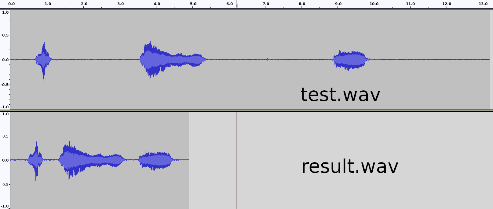

## Trimming Silence from Audio File

### Background

I was bounty hunting on StackOverflow when I came across a question asking about trimming silence using FFMPEG.  The behavior of FFMPEG was so odd that I decided to write my own silence remove functionality for fun.  I was thinking it would just be a few lines in Python with the help of SciPy to read and write the WAVE file and using NumPy to make some quick calculations.  I didn't get around to doing it until after the bounty had already ended, and the original question was from a few years back, but it still intrigued me, so I completed it anyway.

## Intro

Removing long periods of silence from an audio recording seems to be a fairly popular requirement and an interesting endeavour.  As a simple challenge, it's fun to think of clever ways to accomplish this with a simple Python script with some help from SciPy and NumPy.  Stretch goals were auto thresholding as well as any/all channel detection.  I ended up accomplishing those, each time adding yet more lines to something that I thought was already getting bloated from a dream of 20 lines of code!



## How it Works

I have a [version of the script](./trim_silence.py) that's very user-friendly, but for demonstration, it's probably better to have more of a [barebones script](./trim_silence_basics.py).

### The Barebones Script

For the barebones, I'm hardcoding everything from filenames to thresholds and I'm assuming a 16-bit PCM input format.

```python
import numpy as np
from scipy.io import wavfile

# Params
(infile,outfile,threshold_db,silence_dur,non_silence_dur,mode) = ("test_stereo.wav","result.wav",-25,0.5,0.1,"all")
silence_threshold = np.round(10**(threshold_db/20.),6) * 32768 # Convert from dB to linear units and scale, assuming 16-bit PCM input
```

The file reads quickly and easily using SciPy's wavfile:

```python
# Read data
Fs, data = wavfile.read(infile)
silence_duration_samples = silence_dur * Fs
if len(data.shape)==1: data = np.expand_dims(data,axis=1)
```

There are a few steps to find the silence regions.  I couldn't seem to find much in the way of extracting ranges from NumPy except in a manual fashion.

The first step is simply checking which values are below the silence threshold.  I had to do some extra padding for the logic that follows (unfortunately, yes that's potentially another numpy copy...).
```python
# Find silence
find_func = np.min if mode=="any" else np.max
combined_channel_silences = find_func(np.abs(data),axis=1) <= silence_threshold
combined_channel_silences = np.pad(combined_channel_silences, pad_width=1,mode='constant',constant_values=0)
```

The next step is to find the start and stop locations.  There are going to be a lot of these because of all the zero crossings going on.  Unfortunately, that's an in efficiency that I could have easily avoided with C++.  I then calculate the durations of each period of silence and find the ones that are greater than the minimum.

```python
# Get start and stop locations
starts =  combined_channel_silences[1:] & ~combined_channel_silences[0:-1]
ends   = ~combined_channel_silences[1:] &  combined_channel_silences[0:-1]
start_locs = np.nonzero(starts)[0]
end_locs   = np.nonzero(ends)[0]
durations  = end_locs - start_locs
long_durations = (durations > silence_duration_samples)
long_duration_indexes = np.nonzero(long_durations)[0]
```

If there are very short periods of noise in between long periods of silence they might be annoying due to their ear pollution effect.

```python
# Cut out short non-silence between silence
if len(long_duration_indexes) > 1:
    non_silence_gaps = start_locs[long_duration_indexes[1:]] - end_locs[long_duration_indexes[:-1]]
    short_non_silence_gap_locs = np.nonzero(non_silence_gaps <= (non_silence_dur * Fs))[0]
    for loc in short_non_silence_gap_locs:
        end_locs[long_duration_indexes[loc]] = end_locs[long_duration_indexes[loc+1]]
    long_duration_indexes = np.delete(long_duration_indexes, short_non_silence_gap_locs + 1)

    (start_locs,end_locs) = (start_locs[long_duration_indexes], end_locs[long_duration_indexes])
```

I delete multiple ranges of silence from the data using NumPy.  This was a tricky problem.  The best way I found to do this was to compile a list of indexes to pass over to np.delete().  This keeps me from having to deal with index numbers changing as a delete data in a piece-wise fashion.  What would be nice is if I could just pass numpy a list of ranges instead of an full list of indexes.  See Improvements below for my admission that this is a bit unnecessary;  data can be skipped over when writing it out instead of deleting it all.  The noise that's kept is evenly split between the beginning and end of the noise section, so it's possible to hear a bit of a discontinuity if the difference between the two sections is significant.

```python
# Trim data
if len(long_duration_indexes) > 1:
    if len(start_locs) > 0:
        keep_at_start = int(silence_duration_samples / 2)
        keep_at_end = int(silence_duration_samples - keep_at_start)
        start_locs = start_locs + keep_at_start
        end_locs = end_locs - keep_at_end
        delete_locs = np.concatenate([np.arange(start_locs[idx],end_locs[idx]) for idx in range(len(start_locs))])
        data = np.delete(data, delete_locs, axis=0)
```

Finally, the easy one-liner to write out the resulting WAVE file.

```python
# Output data
wavfile.write(outfile, Fs, data)
```

<hr>

### Auto-Thresholding

I didn't include this in the barebones script, because it slows things down a tad and isn't really that necessary compared to just picking a good number.  The gist of it is to use a 100-bin, density-based histogram approach to find a good cutoff.  To do this, I find the knee in the curve by calculating the slope and looking for where that starts to taper off.  In the full-featured script, I allow for setting an auto-threshold-aggressiveness factor, which basically moves the chosen bin up or down.

Here's a simplified version for easier reading.  When dealing with multiple channels, I call something close to this and find the maximum threshold across all channels.  It's also possible to calculate it for just the first channel.  Either of these approaches have weaknesses.  A nicer solution may allow for the threshold to change over time and maintain unique thresholds for each channel.  That way if you have a stereo recording, but one channel is much louder than another, it won't cause the quieter one to be deemed silent.

```python
def auto_threshold(data):
    x = np.abs(data)
    hist,edges = np.histogram(x,bins=100,density=True)
    slope = np.abs(hist[1:] - hist[:-1])
    argmax = np.argmax(slope < 0.00002)
    return edges[argmax]
```

<hr>

### Falling back on Python's Wave Module
If SciPy isn't available, the script will "fall back" to using the wave module that comes with Python.  It can't handle as many formats as the SciPy module and results in slower loading and saving.  If you run the script in `--verbose` mode, you'll see a brief mention if SciPy is unavailable.

### Some More Catches
When using this tool to remove silence from another audio format, such as mp3, m4a, etc., you have to first convert to .wav and then convert the resulting file back.  SciPy and Wave don't handle the metadata, but you can copy that back over when converting.

- Convert mp3 to wav: `ffmpeg -i myfile.mp3 myfile.wav`
- Run Silence Remover: `python3 trim_silence.py --input=myfile.wav`
- Convert back while copying metadata from original: `ffmpeg -i result.wav -i myfile.mp3 -map_metadata 1 myfile_trimmed.mp3`


### Improvements
Some possible improvements:
- clean up the code!  it was a quick job, so I have some mixed approaches in the architecture
- have a dynamic auto threshold system
- have a per-channel auto threshold detection system
- use numpy's strider and memory mapping to read the file progressively
- instead of trimming then writing, just write the sections that won't get deleted
- smooth the transitions after deleting sections of silence
- write in C++ to save execution time

<hr>

## Usage for the Full-Featured Script

The [full-featured script](./trim_silence.py) allows for a lot of control.  Here's the usage for it:
```
python3 trim_silence.py -h
usage: trim_silence.py [-h] --input INPUT [--output OUTPUT] [--threshold THRESHOLD] [--silence-dur SILENCE_DUR] [--non-silence-dur NON_SILENCE_DUR] [--mode MODE]
                       [--auto-threshold] [--auto-aggressiveness AUTO_AGGRESSIVENESS] [--detect-only] [--verbose] [--show-silence] [--time-it] [--overwrite]

optional arguments:
  -h, --help            show this help message and exit
  --input INPUT         (REQUIRED) name of input wav file (default: None)
  --output OUTPUT       name of output wave file (default: result.wav)
  --threshold THRESHOLD
                        silence threshold - can be expressed in dB, e.g. --threshold=-25.5dB (default: -25dB)
  --silence-dur SILENCE_DUR
                        maximum silence duration desired in output (default: 0.5)
  --non-silence-dur NON_SILENCE_DUR
                        minimum non-silence duration between periods of silence of at least --silence-dur length (default: 0.1)
  --mode MODE           silence detection mode - can be 'any' or 'all' (default: all)
  --auto-threshold      automatically determine silence threshold (default: False)
  --auto-aggressiveness AUTO_AGGRESSIVENESS
                        aggressiveness of the auto-threshold algorithm. Integer between [-20,20] (default: 3)
  --detect-only         don't trim, just detect periods of silence (default: False)
  --verbose             print general information to the screen (default: False)
  --show-silence        print locations of silence (always true if --detect-only is used) (default: False)
  --time-it             show steps and time to complete them (default: False)
  --overwrite           overwrite existing output file, if applicable (default: False)
```

### Example Runs:

Simplest usage causes no output and writes to the default result.wav if it doesn't already exist.
```
python3 trim_silence.py --input=test.wav
```

Detect-Only mode produces nicely formatted values that can easily be parsed and fed into other software:
```
python3 trim_silence.py --input=test.wav --detect-only
start         end           duration    
0.0           0.703787      0.703787    
1.064898      3.580181      2.515283    
5.298526      8.895329      3.596803    
9.763719      13.192449     3.42873     
```

More verbose output and using auto-thresholding:
```
python3 trim_silence.py --input=test.wav --overwrite --verbose --show-silence --auto-threshold --auto-aggressiveness=10
Inputs:
  Input File: test.wav
  Output File: result.wav
  Max. Silence Duration: 0.5
  Min. Non-silence Duration: 0.1
  Silence Threshold: AUTO (aggressiveness=10)
  Silence Mode: ALL

Input File Duration = 13.192449

Periods of silence shown below
start         end           duration    
0.0           0.70551       0.70551     
1.064853      3.580703      2.51585     
5.269297      8.895351      3.626054    
9.756644      13.192449     3.435805    

Output File Duration = 4.909229
```

result.wav:

